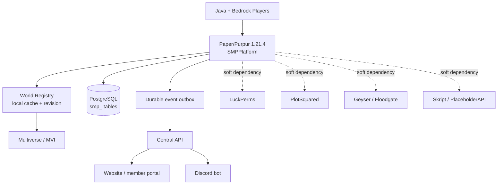

# Architecture

> **Status:** This is an implementation design, example configuration, and operations runbook for the intended SMPPlatform service. It does **not** claim that a JAR, database, external API, integration, backup, or deployment has been executed. The target is **Paper/Purpur 1.21.4 on Java 21**, with a **server-side-only** plugin. Java and Bedrock players use the same gameplay system; no client mod is required.

## System boundary

SMPPlatform is the server-side Minecraft platform adapter. Paper/Purpur owns the game runtime. Multiverse owns low-level world lifecycle. LuckPerms owns permission calculations. PlotSquared owns plot mechanics. The Central Platform owns website accounts, Discord configuration, and Discord delivery. PostgreSQL is authoritative for SMPPlatform gameplay records. The plugin does not operate a Discord bot and does not duplicate third-party source-of-truth data.[1]

## Module boundaries

| Module | Responsibility | Persistence / integration |
|---|---|---|
| World Registry | validates definitions, revision, cache, access policy | `smp_worlds`, `worlds.yml`, Central API |
| Identity | maps Minecraft UUID to platform player and edition | `smp_players`, `smp_minecraft_accounts`, Floodgate API |
| Guilds | guild lifecycle, ranks, membership, invites | `smp_guild*` |
| Points | serialized balances and immutable ledger | `smp_point_accounts`, `smp_point_transactions` |
| Hardcore | state machine, deaths, reset eligibility | `smp_hardcore*` |
| Events | event lifecycle, arenas, registration, results | `smp_events`, `smp_arenas`, results |
| Operations | GUI, moderation adapters, audit, reset/backup | `smp_audit_logs`, resets, backups |
| Synchronization | nonblocking API client and retryable delivery | `smp_event_outbox`, `smp_integration_state` |

## Concurrency and failure model

Paper-thread listeners capture minimal state, schedule database/API work asynchronously, and return Bukkit/Paper mutations to the primary thread only when safe. Balance modifications use a transaction, row lock or optimistic account version, one ledger insert, and an idempotency key. HTTP is asynchronous and outbox delivery is leased, retried with capped exponential backoff, and acknowledged idempotently. No external API or optional plugin failure is fatal to server startup. PostgreSQL loss enters **degraded mode**: no points, guild, hardcore, moderation, link, or destructive reset mutation is accepted until persistence recovers; staff receive a redacted alert. [1] [5]

## Security constraints

Codes for `/link` are random, short-lived, rate-limited, single-use, hash-only at rest, revocable, and audited. Player identity is UUID/account mapping; no username prefix is treated as a permanent Bedrock identity. Input is validated, SQL is prepared, API payloads are schema-validated, permissions are checked before actions, and destructive GUI actions require explicit confirmation.

## References

[1]: file:///home/ubuntu/upload/pasted_content_3.txt "Authoritative SMPPlatform plugin brief"
[2]: file:///home/ubuntu/neon-nexus-hub/src/data/mock.ts "Neon Nexus website product specification"
[3]: https://docs.papermc.io/paper/ "Paper documentation"
[4]: https://luckperms.net/wiki/Developer-API "LuckPerms Developer API"
[5]: https://mvplugins.org/ "Multiverse documentation"
[6]: https://geysermc.org/wiki/floodgate/ "Floodgate overview"
